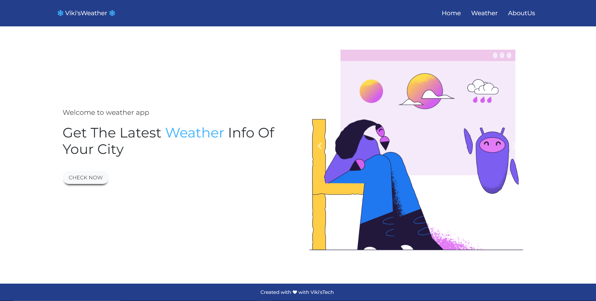
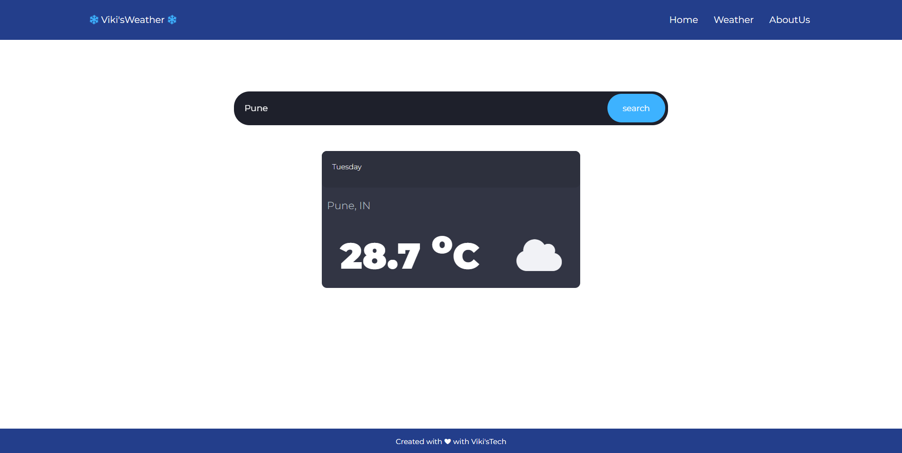
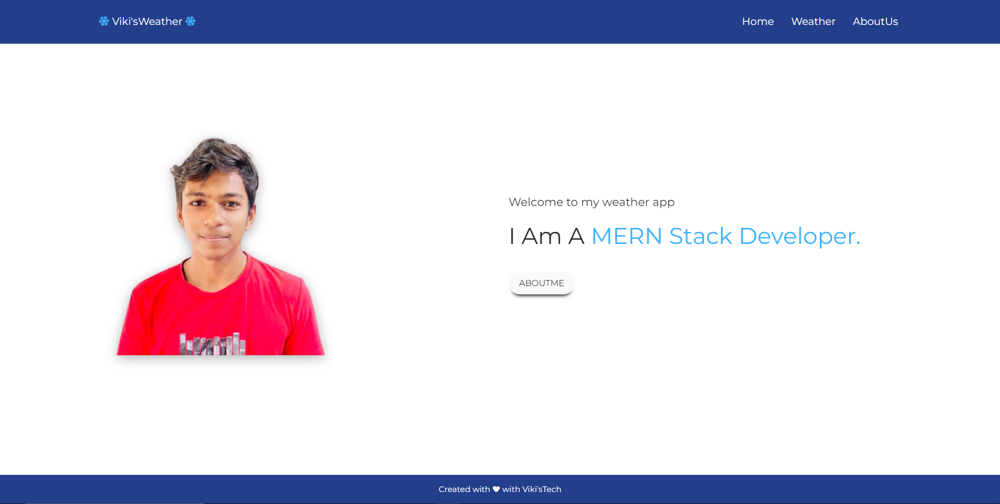
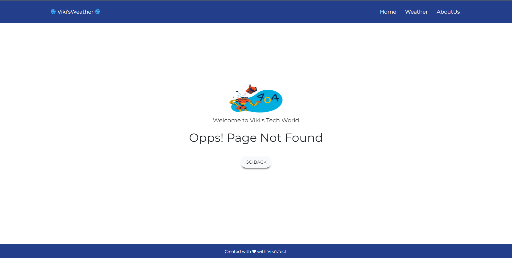

# ❄ WeatherApp ❄
* This WeatherApp is a web app where you can search city name to find out the weather of that city. 

* This is made using this following technologies:-

---

## 👩‍💻 FrontEnd:-

  1. Html.
  
  2. Css.
  
  3. JavaScript.
  
  4. Bootstrap.
  
 ## 👨‍💻 BackEnd:-
  
  1. Node.js.

---

 ## Screenshot :-

 * Home Page

      

 * Weather Page

     

 * About Page

     

 * Error Page

     

